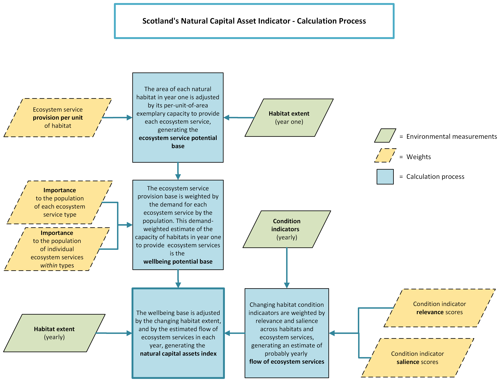

<style>
  h3 {
    margin-top: 35px;
  }
  h2 {
    margin-top: 35px;
  }
</style>
```{r, include = FALSE}
knitr::opts_chunk$set(
  collapse = TRUE,
  comment = "#>"
)
```

## Introduction

The **openNCAI** package calculates a regional natural capital assets index (NCAI) using the method designed by NatureScot to calculate Scotland's NCAI. The idea behind the NCAI is that by finding a way to express changing the value of natural capital, we make it easier for policymakers to consider the role of the natural environment in our well-being and the economy.

Why build this package? By engineering the NCAI process in R, we make it easy to create a reproducible trace of the calculation. That means that a reader can see exactly how the statistic was produced and check its validity, and take and use the calculator for themselves. 

By building the calculation as an R function, we facilitate custom adjustments to the framework. For example, another country might want to index their natural capital assets: by feeding in their own data and their own habitat and ecosystem classifications, they can do so. NatureScot's method uses habitat and ecosystem classifications based on established taxonomies - European Nature Information System (EUNIS) habitat types, the System of Environmental-Economic Accounting (SEEA) and the Common International Classification of Ecosystem Services (CICES) - so there is likely to be shared relevance for other European regions.

Building a reusable, customisable tool also means that we can explore some of the assumptions which underpin the NCAI model, or update them. We might decide that, 20 years after the index was first designed, some natural assets are more valuable to the population than they were before. We can reprogram the index and see if the story changes. We might like to know if new satellite imagery could replace the ecological surveys which currently provide data about the extent and condition of natural habitats. We could calculate the index with both types of data and compare the results.

In this vignette, we work through reproducing the Scottish statistic, using data assets provided by NatureScot used to calculate the index in years 2000 - 2022.

## Setup

We start by attaching openNCAI and some other packages needed for this demonstration:

```{r setup, message = FALSE, warning = FALSE}
library(openNCAI)
library(ggplot2)
library(dplyr)
library(tibble)
```

## Accessing Package Data

openNCAI comes bundled with a set of data assets used by NatureScot to calculate Scotland's NCAI from 2000 to 2022.

Because these are built in to the package we can access the data objects directly. For example, we can show a snippet of the habitat extent data by calling the object 'ns_habitat_extent':

```{r inspect_measurement-data}
head(ns_habitat_extent[,1:3])
```

## Understanding The Required Data Inputs

openNCAI requires three types of data:

1. **Metadata** which define the natural habitats under consideration, the ecosystem services they provide, and the years across which the index is to be calculated,

2. **Environmental measurements** recording the extent and condition of the natural habitats over the years,

3. **Weighting scores** - decided by experts at the beginning of the process; these denote the relative importance of different ecosystem services, the potential of different habitats to provide each each, and the salience of the available habitat condition indicators to represent flow of services from habitats.

Let's find out more about the contents and shape of the included data objects which fulfill these roles...

### Metadata

Three metadata objects are included:

```{r metadata-table, echo = FALSE}
d_subset <- data.frame(
  `Object Name` = c(
    "ns_habitats_label_tree", 
    "ns_es_label_tree", 
    "ns_year_list"
  ),
  `Description` = c(
    "Habitats Label Tree: a hierarchy of natural habitats (based on EUNIS[^1] level 2) grouped within their respective broad habitat categories (EUNIS level 1) found in Scotland.",
    "Ecosystem Services Label Tree: a hierarchy of individual CICES[^2] ecosystem services (ES) organized by their SEEA[^3] service type groups (Provisioning, Regulation & Maintenance, and Cultural).",
    "Year List: the specific range of years over which the index is calculated."
  ),
  `Data Format` = c(
    "A named list of character vectors where names are broad habitats and vectors contain the specific habitats within them.",
    "A named list of character vectors where names are service types and vectors contain the individual services.",
    "A character vector of years."
  ),
  check.names = FALSE
)

knitr::kable(d_subset)
```
[^1]: [European Nature Information System](https://eunis.eea.europa.eu/)
[^2]: [Common International Classification of Ecosystem Services](https://cices.eu/)
[^3]: [System of Environmental-Economic Accounting](https://seea.un.org/)

It is important that all measurement and weights objects are congruent with the metadata. E.g. time series data must include all the years mentioned in the year list, and weighting scores must be expressed across the habitats and ecosystem services listed in the label trees.

Also required but not included explicitly as a data object is a **list of condition indicators** (CIs): this is extracted from the column names of the Condition Indicator Score Matrix (`ns_ci_scores`) described in the next table. 

We can inspect the objects and verify some of the dimensions and labels:

```{r view-metadata}
# The label trees are nested lists.
# E.g. See the first couple of broad habitats and the habitats within them.
ns_habitats_label_tree[1:2]

# Or the names of the ES label tree:
names(ns_es_label_tree)

# And the labels within the last group 'Cultural':
ns_es_label_tree[3]
```

### Environmental Measurements

These measures constitute time series recording the extent (area) and condition of natural habitats over the years of the index. Included are:

```{r measurement_table, echo = FALSE}
d_subset <- data.frame(
  `Object Name` = c(
    "ns_habitat_extent", 
    "ns_ci_scores"
  ),
  `Description` = c(
    "Habitat Extent for Scotland: measurement in hectares of the area of each natural habitat over the years.",
    "Condition Indicator Score Matrix: yearly condition score on each of the Condition Indicators (CIs)."
  ),
  `Data Format` = c(
    "A data frame where rows are habitats and columns are years.",
    "A data frame where rows are years and columns are CIs."
  ),
  check.names = FALSE
)

knitr::kable(d_subset)
```

Note that the dimensions and labelling of the measurement data should match the metadata:

```{r view-measurement}
# E.g. The habitat extent data has 31 rows and 23 columns: 
dim(ns_habitat_extent)

# The 31 rows match the habitats in the (unlisted) Habitats label tree:
all_habitats <- unlist(ns_habitats_label_tree, use.names = FALSE)
length(all_habitats)
all.equal(all_habitats, rownames(ns_habitat_extent))

# The condition score data has one row per year and these years match the year list: 
dim(ns_ci_scores)
length(ns_year_list)

# The row names match the year list too:
all.equal(rownames(ns_ci_scores), ns_year_list)
```

### Weighting Scores

These data objects include scores decided by expert knowledge at the outset of the index. Included are:

```{r weights_table, echo = FALSE}
d_subset <- data.frame(
  `Object Name` = c(
    "ns_provision_per_unit_scores", 
    "ns_between_importance_scores", 
    "ns_within_importance_scores", 
    "ns_ci_relevance_matrices", 
    "ns_indicator_directory", 
    "ns_custom_weight_matrix"
  ),
  `Description` = c(
    "Ecosystem Service Provision Potential per Unit Scores: scores denoting the relative potential of one area unit of a habitat to provide each of the ecosystem services.",
    "Ecosystem Service Importance Scores (**between**-service-type): scores denoting the relative importance of the different ecosystem service **types** ('Provisioning', 'Regulation & Maintenance', 'Cultural') to Scotland.",
    "Ecosystem Service Importance Score (**within**-service-type): scores denoting the relative importance of individual ecosystem services within their service type group.",
    "Condition Indicator Relevance Matrices: a set of matrices marking whether an indicator is relevant to specific habitat/ecosystem service combinations (e.g., 'Woodland bird index' relevance to 'Pollination').",
    "Indicator Directory: a table recording the salience of each condition indicator (between 0 and 1) in representing the capacity of habitats to provide each ecosystem service type.",
    "NatureScot's Custom Divisor Matrix: weights used in this particular case to adjust potential provision scores to reflect scale and context dependence (e.g., adjusting scores by dividing by 1 instead of 5)."
  ),
  `Data Format` = c(
    "A data frame where rows are habitats and columns are ecosystem services.",
    "A named list of numeric values where names match the top-level names of the Service Label Tree.",
    "A nested list of named lists, with a hierarchy matching the Service Label Tree.",
    "A named list of data frames (one per CI) with binary (1/0) values; rows are habitats and columns are ecosystem services.",
    "A data frame with a `ci_id` column and columns for each ecosystem service type containing salience scores.",
    "A data frame where row names are habitats and column names are ecosystem services."
  ),
  check.names = FALSE
)

knitr::kable(d_subset)
```


Several of the weights objects are matrices of **habitat / ecosystem service** type. These are provided as data frames with rows matching the unlisted habitats label tree and columns matching the unlisted ecosystem service label tree:

```{r view-weights}
all_habitats <- unlist(ns_habitats_label_tree, use.names = FALSE)
all_ecosystem_services <- unlist(ns_es_label_tree, use.names = FALSE)

# The Provision Per Unit Scores, any custom divisor matrix, and each matrix in the CIRMs list need to match:
one_ci_relevance_matrix <- ns_ci_relevance_matrices[[4]]

length(all_habitats)
nrow(ns_provision_per_unit_scores)
nrow(ns_custom_divisor_matrix)
nrow(one_ci_relevance_matrix)

all.equal(all_habitats, rownames(ns_provision_per_unit_scores))
all.equal(all_habitats, rownames(ns_custom_divisor_matrix))
all.equal(all_habitats, rownames(one_ci_relevance_matrix))

length(all_ecosystem_services)
ncol(ns_provision_per_unit_scores)
ncol(ns_custom_divisor_matrix)
ncol(one_ci_relevance_matrix)

all.equal(all_ecosystem_services, colnames(ns_provision_per_unit_scores))
all.equal(all_ecosystem_services, colnames(ns_custom_divisor_matrix))
all.equal(all_ecosystem_services, colnames(one_ci_relevance_matrix))
```

openNCAI includes two helper functions - `create_ncai_template()` and `read_ncai_template` - to help assemble data and get it into the right format for calculation. Read more about them in [Using openNCAI's Data Entry Templates](using_openNCAIs_data_entry_templates.html).

## Calculating The Overall Index

The index is calculated using the `get_ncai()` function. By default the final overall index is returned. 

```{r calc-overall}
overall_ncai <- get_ncai(
                  habitat_extent = ns_habitat_extent,
                  ci_scores = ns_ci_scores,
                  habitats_label_tree = ns_habitats_label_tree,
                  es_label_tree = ns_es_label_tree,
                  year_list = ns_year_list,
                  provision_per_unit_scores = ns_provision_per_unit_scores,
                  custom_divisor_matrix = ns_custom_divisor_matrix,
                  between_importance_scores = ns_between_importance_scores,
                  within_importance_scores = ns_within_importance_scores,
                  ci_relevance_matrices = ns_ci_relevance_matrices,
                  indicator_directory = ns_indicator_directory
                  )
```

Three versions of the index are returned, the raw total, the raw index, and the smoothed index (values are a weighted average of the last 5 years' values, giving more weight to more recent entries):

```{r show-head-overall}
head(overall_ncai)
```

We can select just the raw indexed values to display:
```{r selct-raw-overall}
raw_index <- overall_ncai[, "raw_index", drop = FALSE]
raw_index
```

And we can graph the index:


<details>
<summary>Click to see the R code used to build the graph</summary>

```{r build-overall-plot}
# Make some nice display labels:
graph_labels <- c(
  "overall"
  = "Overall",
  # --- Service Types ---
  "provisioning"
  = "Provisioning",
  "regulation_and_maintenance"
  = "Regulation & Maintenance",
  "cultural"
  = "Cultural",
  # --- Broad Habitats ---
  "b_coastal_habitats"
  = "Coastal",
  "c_inland_surface_waters"
  = "Freshwater",
  "d_mires_bogs_and_fens"
  = "Mires, Bogs & Fens",
  "e_grasslands_and_lands_dominated_by_forbs_mosses_or_lichens"
  = "Grasslands",
  "f_heathland_scrub_and_tundra"
  = "Heathland",
  "g_woodland_forest_and_other_wooded_land"
  = "Woodland",
  "h_inland_unvegetated_or_sparsely_vegetated_habitats"
  = "Inland Unvegetated",
  "i_cultivated_agricultural_horticultural_and_domestic_habitats"
  = "Agri/Horticultural",
  "j_constructed_industrial_and_other_artificial_habitats"
  = "Constructed",
  "k_montane"
  = "Montane"
)


# Prepare overall index data:
main_index_for_plot <- overall_ncai |>
  rownames_to_column(var = "year") |>
  mutate(
    year = as.numeric(year),
    breakdown = "overall",
    display_name = recode(breakdown, !!!graph_labels)
  )

# Plot the Overall Index
overall_plot <- ggplot(main_index_for_plot, aes(x = year, y = raw_index)) +
  geom_line() +
  scale_y_continuous(
    limits = c(90, 110),           # <--- Forces the 90-110 range
    breaks = seq(90, 110, by = 2)
  ) +
  scale_x_continuous(
    breaks = seq(2000, 2022, by = 3)
  ) +
  labs(
    title = "NCAI (Overall)",
    x = "Year",
    y = "Index (Base = 100)"
  ) +
  theme_classic() +
  theme(plot.title = element_text(face = "bold", hjust = 0.5))


```
</details>

```{r show-overall-plot, fig.width = 7, fig.height = 4.5, fig.align = "center"}
overall_plot
```


## Generating Breakdowns By Service Type or Broad Habitat

By passing `"by_ecosystem_service_type"` or `"by_broad_habitat"` to the optional `return` argument, we can generate a list of data frames containing the index broken down ecosystem service type or by broad habitat respectively. 

```{r index-breakdown-st}
ncai_by_ecosystem_service_type <- get_ncai(
    habitat_extent = ns_habitat_extent,
    ci_scores = ns_ci_scores,
    habitats_label_tree = ns_habitats_label_tree,
    es_label_tree = ns_es_label_tree,
    year_list = ns_year_list,
    provision_per_unit_scores = ns_provision_per_unit_scores,
    custom_divisor_matrix = ns_custom_divisor_matrix,
    between_importance_scores = ns_between_importance_scores,
    within_importance_scores = ns_within_importance_scores,
    ci_relevance_matrices = ns_ci_relevance_matrices,
    indicator_directory = ns_indicator_directory,
    return = "by_ecosystem_service_type"
  )

# A named list of data frames is returned, with names as per the ES label tree:
names(ncai_by_ecosystem_service_type)

# See the contribution of cultural services to the index:
cultural_breakdown <- ncai_by_ecosystem_service_type[["cultural"]]
cultural_breakdown
```

We can plot the breakdowns with the main trend line. 

<details>
<summary>Click to see the code used to build the graph</summary>
```{r build-st-plot}
# Set up the data:
by_st_for_plot <- ncai_by_ecosystem_service_type[names(ns_es_label_tree)] |>
  lapply(function(df) {
    df |>
      rownames_to_column(var = "year") |>
      mutate(year = as.numeric(year)) # Convert here!
  }) |>
  bind_rows(.id = "breakdown") |>
  bind_rows(main_index_for_plot) |>
  mutate(
    display_name = recode(breakdown, !!!graph_labels)
  )

# Build the plot
st_plot <- ggplot(by_st_for_plot, aes(x = year, y = raw_index, color = display_name)) +
  # Basic lines
  geom_line() +

  # Point marker for overall line to distinguish trend
  geom_point(
    data = filter(by_st_for_plot, breakdown == "overall"),
    shape = 18,
    size = 3
  ) +

  # Fix the Y scale to match the 90-110 range
  scale_y_continuous(
    limits = c(90, 110),           # Forces the axis to show the full range
    breaks = seq(90, 110, by = 2)   # Sets consistent tick marks
  ) +

  # Consistent X scale
  scale_x_continuous(
    breaks = seq(2000, 2022, by = 3)
  ) +

  # Labels
  labs(
    title = "NCAI by Ecosystem Service Type",
    x = "Year",
    y = "Index (Base = 100)",
    color = "Service Type"
  ) +

  # Classic theme (solid axis lines, no grid)
  theme_classic() +

  # Minimal centering for the title
  theme(
    plot.title = element_text(face = "bold", hjust = 0.5)
  )

```
</details>

```{r show-st-plot, fig.width = 7, fig.height = 5.25, fig.align = "center"}
st_plot + 
  theme(legend.position = "bottom") +
  guides(color = guide_legend(nrow = 1))
```


And we can use the same approach to generate a breakdown by broad habitat:
```{r index-breakdown-bh}
ncai_by_broad_habitat <- get_ncai(
                          habitat_extent = ns_habitat_extent,
                          ci_scores = ns_ci_scores,
                          habitats_label_tree = ns_habitats_label_tree,
                          es_label_tree = ns_es_label_tree,
                          year_list = ns_year_list,
                          provision_per_unit_scores = ns_provision_per_unit_scores,
                          custom_divisor_matrix = ns_custom_divisor_matrix,
                          between_importance_scores = ns_between_importance_scores,
                          within_importance_scores = ns_within_importance_scores,
                          ci_relevance_matrices = ns_ci_relevance_matrices,
                          indicator_directory = ns_indicator_directory,
                          return = "by_broad_habitat"
                        )

# We get a list of data frames with names as per the top level of the habitats label tree:
names(ncai_by_broad_habitat)

# See the contribution to the index of the broad habitat group Mires, Bogs and Fens:
bogs_breakdown <- ncai_by_broad_habitat[["d_mires_bogs_and_fens"]]
bogs_breakdown
```
NatureScot typically reports the contribution to the index of a subset seven of the broad habitats. We can build this list and, as before, graph these contributions with the main trend line.

<details>
<summary>Click to see how we build the graph</summary>
```{r build-bh-plot}
# Specify custom list of broad habitats to use:
ns_bh_breakdown_list <- c(names(ns_habitats_label_tree)[c(1:6, 8)])

# Prepare the data:
by_bh_for_plot <- ncai_by_broad_habitat[ns_bh_breakdown_list] |>
  lapply(function(df) {
    df |>
      rownames_to_column(var = "year") |>
      mutate(year = as.numeric(year))
  }) |>
  bind_rows(.id = "breakdown") |>
  bind_rows(main_index_for_plot) |>
  mutate(
    display_name = recode(breakdown, !!!graph_labels)
  )

# Build the plot:
bh_plot <- ggplot(by_bh_for_plot, aes(x = year, y = raw_index, color = display_name)) +
  # Lines for all habitats
  geom_line() +

  # Diamond marker on the overall trend line
  # We filter by 'breakdown' because that remains "overall" internally
  geom_point(
    data = filter(by_bh_for_plot, breakdown == "overall"),
    shape = 18,
    size = 3
  ) +

  # Fix the Y scale 
  scale_y_continuous(
    limits = c(90, 120),           # Forces the axis to show the full range
    breaks = seq(90, 120, by = 2)   # Sets consistent tick marks
  ) +

  # Consistent X scale
  scale_x_continuous(
    breaks = seq(2000, 2022, by = 3)
  ) +

  # Labels
  labs(
    title = "NCAI by Broad Habitat",
    x = "Year",
    y = "Index (Base = 100)",
    color = "Habitat Type"
  ) +

  # The requested classic theme
  theme_classic() +

  # Minimal centering for the title
  theme(
    plot.title = element_text(face = "bold", hjust = 0.5)
  )
```
</details>
```{r show-bh-plot, fig.width = 7, fig.height = 6, fig.align = "center"}
bh_plot + 
  theme(legend.position = "bottom") +
  guides(color = guide_legend(nrow = 3))
```


## Digging Deeper - Accessing Elements of the Calculation Process

Using the optional `return` argument, we can access various elements of the calculation process. The following options are available to be passed to `return`:

```{r return-options, echo = FALSE}
# Define the return options and their descriptions
ncai_options <- data.frame(
  `Value` = c(
    "**\"overall_ncai\"**", 
    "**\"by_ecosystem_service_type\"**", 
    "**\"by_broad_habitat\"**", 
    "**\"wellbeing_index\"**",
    "**\"flow_of_es_index\"**",
    "**\"yearly_ncai_matrices\"**", 
    "**\"yearly_wellbeing_matrices\"**",
    "**\"yearly_flow_of_es_matrices\"**",
    "**\"es_potential_base\"**", 
    "**\"wellbeing_potential_base\"**", 
    "**\"flow_of_es_base\"**",
    "**\"everything\"**"
  ),
  `Output Type` = c(
    "Data Frame", "Data Frame", "Data Frame", "Data Frame", "Data Frame",
    "List of Matrices", "List of Matrices", "List of Matrices",
    "Matrix", "Matrix", "Matrix", "Named List"
  ),
  `Description` = c(
    "The standard overall NCAI data frame (default).",
    "NCAI results broken down specifically by Ecosystem Service Type.",
    "NCAI results broken down specifically by Broad Habitat category.",
    "The indexed potential wellbeing contribution of habitats over time (habitat extent weighted by provision-per-unit and importance).",
    "The indexed likely flow of ecosystem services over time, derived from relevance-weighted condition indicator data.",
    "Unaggregated annual matrices of asset value for every habitat/ecosystem service combination.",
    "Unaggregated annual matrices representing potential wellbeing values per habitat and ecosystem service. Calculated as yearly Habitat Extent * Wellbeing Base",
    "Unaggregated annual matrices representing the likely flow of ecosystem services per habitat and ecosystem service, for each year.",
    "Ecosystem Service Potential Base: habitat extent weighted by exemplary provision-per-unit scores in year one.",
    "Wellbeing Potential Base: the potential wellbeing matrix for the baseline year (Year One).",
    "The likely service flow matrix for the baseline year (Year One).",
    "A comprehensive named list containing all of the objects listed above."
  )
)

# Render the table
knitr::kable(ncai_options,
             col.names = c("Argument Value", "Output Type", "Description"),
             escape = FALSE)
```
This diagram illustrates the calculation process:

```{r, echo=FALSE, fig.cap="NCAI Calculation Process Diagram", out.width="100%"}

```

Having access to intermediate stages of the calculation means we can, for example, look at how the changing potential wellbeing contribution (**extent** of habitats weighted by potential per-unit provision of services and by importance to the population) and the changing estimated flow of ecosystem services (based on **condition** of habitats) and how these relate to the overall valuation.

First, we generate the full suite of objects:

```{r get-everything}
# Generate all intermediate and final objects
ncai_all_objects <- get_ncai(
  habitat_extent = ns_habitat_extent,
  ci_scores = ns_ci_scores,
  habitats_label_tree = ns_habitats_label_tree,
  es_label_tree = ns_es_label_tree,
  year_list = ns_year_list,
  provision_per_unit_scores = ns_provision_per_unit_scores,
  custom_divisor_matrix = ns_custom_divisor_matrix,
  between_importance_scores = ns_between_importance_scores,
  within_importance_scores = ns_within_importance_scores,
  ci_relevance_matrices = ns_ci_relevance_matrices,
  indicator_directory = ns_indicator_directory,
  return = "everything"
)
```

Now we can visualise the relationship between the extent and condition components, and the final index:

<details>
<summary>Click to see how we build the graph</summary>
```{r build-extent-condition-plot}
library(ggplot2)
library(tidyr)
library(dplyr)

# 1. Prepare the data
# Extract years and values into a long-format data frame
plot_data <- data.frame(
  Year = as.numeric(rownames(ncai_all_objects$overall_ncai)),
  Overall = ncai_all_objects$overall_ncai$raw_index,
  Wellbeing = ncai_all_objects$wellbeing_index$raw_index,
  Flow = ncai_all_objects$flow_of_es_index$raw_index
)

# Calculate correlations for the annotation
cor_wellbeing <- round(cor(plot_data$Overall, plot_data$Wellbeing, use = "complete.obs"), 3)
cor_flow <- round(cor(plot_data$Overall, plot_data$Flow, use = "complete.obs"), 3)

# Pivot to long format for ggplot
plot_data_long <- plot_data %>%
  tidyr::pivot_longer(cols = -Year, names_to = "Index", values_to = "Value")

# 2. Create the ggplot
driver_plot <- ggplot(plot_data_long, aes(x = Year, y = Value, color = Index, shape = Index)) +
  geom_line(linewidth = 1) +
  geom_point(size = 3) +
  geom_hline(yintercept = 100, linetype = "dashed", color = "gray50") +
  ylim(90, 110) +
  scale_color_manual(values = c("Overall" = "#BCEE68",
                                "Wellbeing" = "#9AC0CD",
                                "Flow" = "#EEA2AD")) +
  labs(title = "NCAI Components & Correlation",
       subtitle = "Comparing overall index trends with area (Wellbeing) and quality (Flow) drivers",
       x = "Year",
       y = "Index (Base Year = 100)",
       color = "Metric",
       shape = "Metric") +
  theme_minimal() +
  annotate("label", x = Inf, y = -Inf,
           label = paste0("Correlations: Overall/Wellbeing: ", cor_wellbeing,
               "\nOverall/Flow: ", cor_flow),
           hjust = 1.1, vjust = -0.5, size = 3.5,
           fill = "white", label.size = 0.5)


```
</details>
```{r show-driver-plot, fig.width = 7, fig.height = 6, fig.align = "center"}
driver_plot
```
